# Procesverslag
Markdown is een simpele manier om HTML te schrijven.  
Markdown cheat cheet: [Hulp bij het schrijven van Markdown](https://github.com/adam-p/markdown-here/wiki/Markdown-Cheatsheet).

Nb. De standaardstructuur en de spartaanse opmaak van de README.md zijn helemaal prima. Het gaat om de inhoud van je procesverslag. Besteedt de tijd voor pracht en praal aan je website.

Nb. Door *open* toe te voegen aan een *details* element kun je deze standaard open zetten. Fijn om dat steeds voor de relevante stuk(ken) te doen.

## Jij

  
uitwerken voor kick-off werkgroep

  ### Auteur:
  Dara van Rijn

  #### Je startniveau:
  Blauw

  #### Je focus:
  Responsive
 

## Je website

  
uitwerken voor kick-off werkgroep

  ### Je opdracht:
  https://www.coca-cola.com/nl/nl

  #### Screenshot(s) van de eerste pagina (small screen): 
  

  #### Screenshot(s) van de Athletes pagina (small screen):
  
 

## Toegankelijkheidstest 1/2 (week 2)

  
uitwerken na test in 2e werkgroep

  ### Bevindingen
  Lijst met je bevindingen die in de test naar voren kwamen:

  - Ik merkte dat met de bril ik eigenlijk alle tekst nog goed kon lezen. 
    Het contrast van de grijze achtergrond met witte vlakken werkt goed en ook de zwarte tekst op lichte/witte achtergrond  en de witte tekst op donkere achtergrond kon ik allemaal nog goed lezen. 
    Hoe donkerder de afbeeldingen, hoe lastiger om te zien.

  - Met de elastiekjes voor het nabootsen van slechte motoriek merkte ik wel dat het scrollen trager ging. Door deze website navigeer je je voornamelijk door te scrollen en klikken en dat ging nog wel redelijk.

  - Het spasme apparaat liet echt m'n hele arm/hand trippen dus dat ging sws al niet zo goed hahah. Ik denk dat het dan erg ingewikkeld wordt. 

  - Ik heb ook m'n scherm even op zwart wit gezet om een soortvan kleurenblindheid  na te bootsen en dan wordt de site wel heel saai. Je kan 'm nog steeds op dezelfde manier gebruiken, maar het wordt er niet aantrekkelijker op. De rode kleur van coca cola verdwijnt natuurlijk helemaal. Los van de afbeeldingen hebben ze niet heel veel verleidelijke elementen. 

  Voice-over:

  - Ik moest even uitvogelen hoe het werkte, maar toen lukte het wel om door de carousel te navigeren. Hij las de kopjes en tekst voor en zelfs de afbeelding werd gedetailleerd omschreven. Het lukte me in eerste instantie niet om op de knoppen te drukken. Terwijl als je normaal gewoon klikt je naar een andere pagina wordt geleid. 
  Ik kreeg te horen dat ik me op een knop bevond en als ik hierop wilde klikken moest ik control + option + spatie inklikken, maar wanneer ik dat deed gebeurde er niks.

  - De banner werd pas opgelezen als ik van pagina veranderde. Toen ik naar de pagina over De Athletes Code ging omschreef hij de afbeelding wel weer uitgebreid en toen ie naar de Athletes kop ging om het voor te lezen en ik swipete leek het vast te lopen en kreeg ik 'm niet meer aan de praat.
Het viel me op dat niet elke afbeelding omschreven werd.
Toen ik even iets beter begreep hoe het werkte ging het navigeren wel beter, maar het is niet makkelijk. Hij las wel alles voor, maar het voelde chaotisch en de stem is niet fijn.

- WCAG checklist met Ruud ingevuld. Deze papieren bewaar ik.

## Breakdownschets (week 3)

  
uitwerken na afloop 3e werkgroep

  ### De hele home pagina: 
  

  ### Dynamisch deel van de home pagina: 
  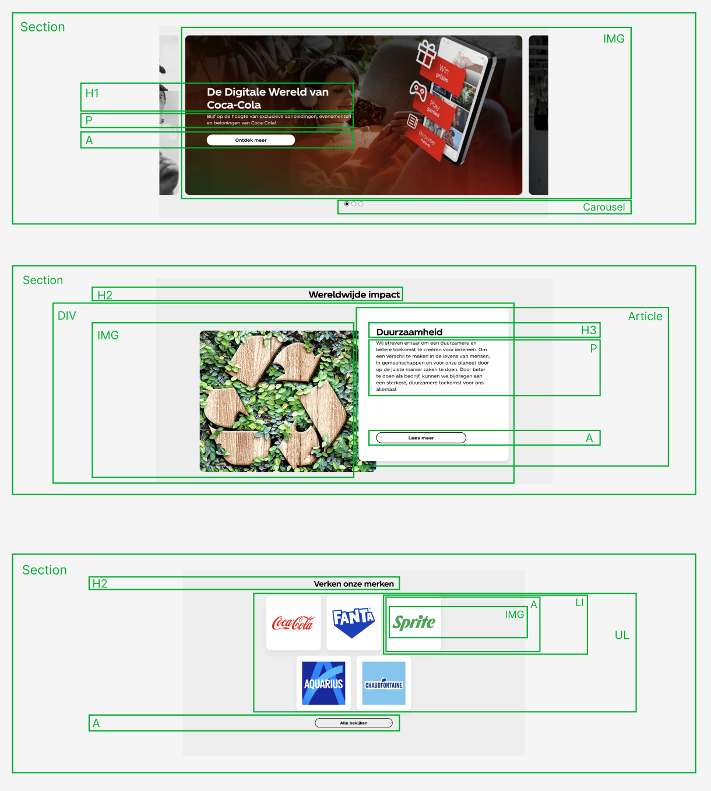

  ### De hele athletes code pagina: 
  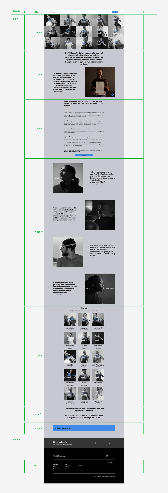
  
  ### Dynamisch deel van de athletes code pagina: 
  

  ### Nog een dynamisch deel van de athletes code pagina:
  

  ### Nog een dynamisch deel van de athletes code pagina:
  

  ### Nog een dynamisch deel van de athletes code pagina:
  

  ### Nog een dynamisch deel van de athletes code pagina:
  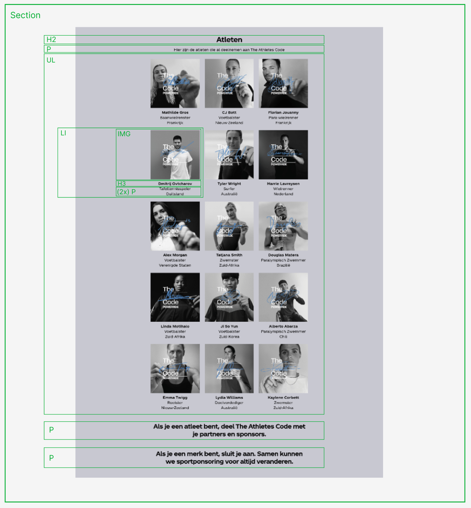

  ### Nog een dynamisch deel van de athletes code pagina:
  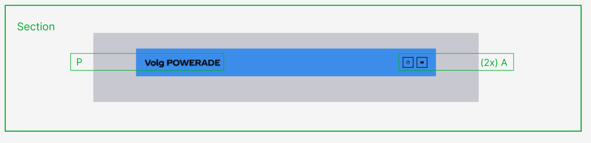

## Voortgang 1 (week 3)

  
uitwerken voor 1e voortgang

  ### Stand van zaken
  Ik vond de eerste les een beetje overweldigend, omdat ik schrok van hoe weinig ik snapte.
  Ik begreep toen wel (en dat was ook al m'n plan van te voren) dat ik dit vak goed moest gaan bijhouden en heb voor de eerste drie lessen de tijd genomen om me goed voor te bereiden. Ik heb de teksten gelezen, video's gekeken en de opdrachten gedaan. Ook heb ik aan een vriend wat extra hulp gevraagd voor Grid en Flexbox.
  Tot nu toe vond ik dit allemaal best goed gaan en ben ik wel trots op hoe serieus ik het neem. 

  Ik heb van allebei de pagina's de breakdownschets volledig gemaakt en dit vond ik fijn om te doen, omdat het een goed overzicht geeft.
  Dit kon ik goed gebruiken bij het begin aan m'n HTML. Ik was van te voren bang dat ik er niet uit zou komen en veel moest gaan vragen, maar eigenlijk merkte ik toen ik eenmaal bezig was dat het best goed te doen was om de HTML te schrijven (dank dus ook aan de breakdownschets). 
  Ik twijfel alleen een beetje over wanneer ik 'div' moet gebruiken en ik vind de footer nog wat ingewikkeld.  
  Voor de CSS en de vervolgstappen ben ik wel een beetje bang, maar hopelijk moet dat ook wel goed komen. 

  Screenshots van mijn HTML tot nu toe:

  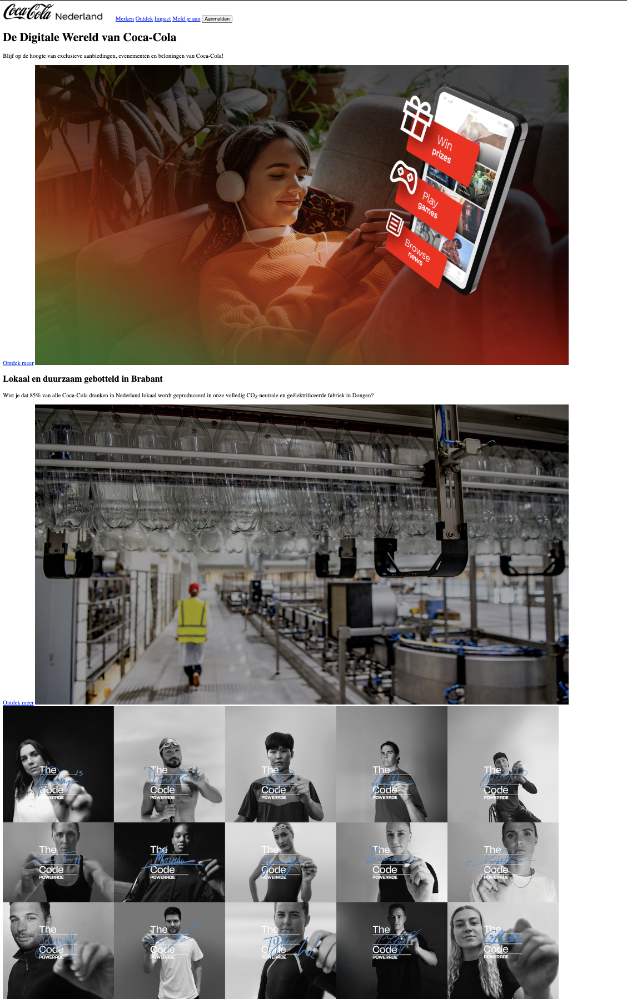
  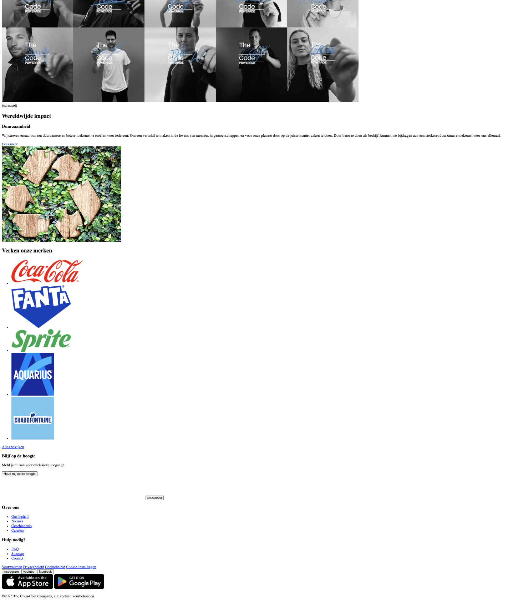
  
  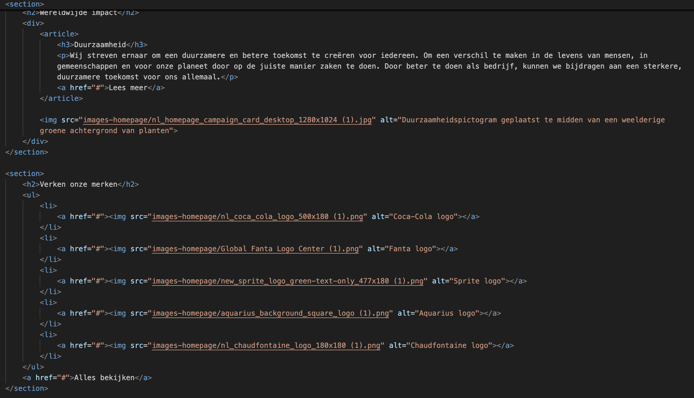
  
  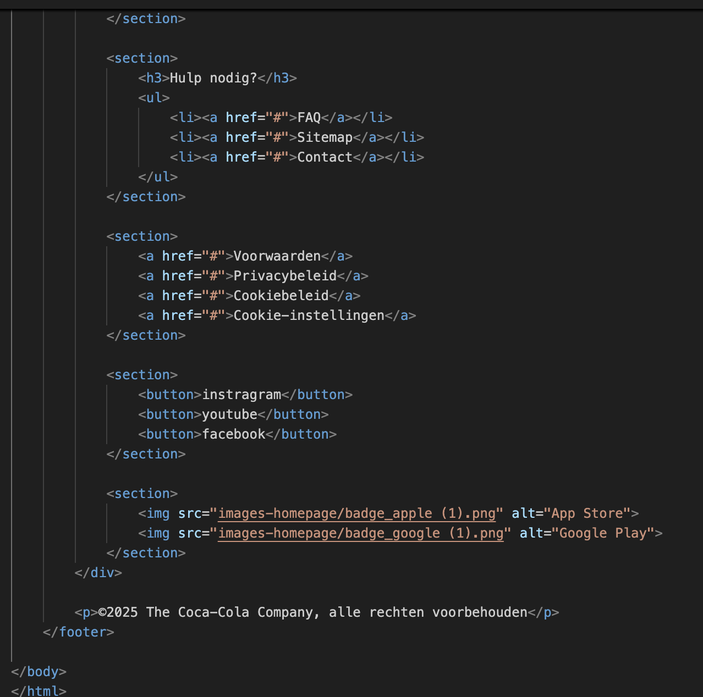
  

  ### Agenda voor meeting
  samen met je groepje opstellen

  | student 1      | student 2          | student 3    | student 4        |
  | ---            | ---                | ---          | ---              |
  | Ik zou graag   | en dit             | en ik dit    | en dan ik dat    |
  | willen kijken  | dit als er tijd is | nog een punt | dit wil ik zeker |
  | of mijn HTML   | ...                | ...          | ...              |
  | klopt en waar
  | ik wel en niet 
  | 'div' moet gebruiken.

  ### Verslag van meeting
  hier na afloop snel de uitkomsten van de meeting vastleggen

  - Wat ik nu als h1 heb naar h2 veranderen en voor h1 logo gebruiken
  - Bij de nav ul en li toevoegen
  - H3 naar H2 veranderen
  - Buttons naar linkjes veranderen
  - Div zoveel mogelijk weglaten, wat ik nu als eerste div in de footer heb gezet kan uit de footer en gewoon een section worden (dan kan div ook weg)
  - Even met Danny checken over de div bij homepage stukje over duurzaamheid

## Voortgang 2 (week 5)

  
uitwerken voor 2e voortgang

  ### Stand van zaken
  Na het eerste voortgangsgesprek heb ik de HTML voor mijn Athletes pagina ook afgemaakt. Dit ging goed.
  Toen was het tijd om aan met de CSS aan de slag te gaan. Ik merkte dat ik wel even vastliep met hoe ik hieraan moest beginnen.
  Ik begon eigenlijk gewoon met de achtergrondkleur en het meest geschikte font vinden en deze toepassen. Omdat ik eigenlijk daarna nog steeds een beetje was van hoe ga ik dit aanpakken besloot ik maar gewoon met de header te starten. 
  Omdat het voelde alsof ik alles echt even kwijt was heb ik wel aan ChatGpT de code gevraagd. Het duurde wel even voordat ik de juiste code had ontvangen en moest telkens vragen om aanpassingen. Toen ik eindelijk tevreden was met hoe het er uitzag was het natuurlijk niet mijn plan om dit klakkeloos over te nemen. Ik wil zelf begrijpen wat wat doet en ging zo een beetje spelen met alle properties. Ik was ook nog niet volledig tevreden over alle groottes dus deze heb ik zelf aangepast tot ik het er beter uit vond zien. Ook heb ik best een aantal properties weggehaald en wat aanpassingen gemaakt in de selectors. Hierna voelde het gelukkig al iets meer alsof de kennis een beetje terug kwam.
  Als je over de menu-items hovert komt er een zwart lijntje en bij sommige beweegt een pijltje. Ik vroeg aan een medestudent (Quinten Kok) of hij mij hiermee kon helpen. Hij heeft dit toen heel mooi in mijn CSS getypt alleen begreep ik er zelf helaas nog weinig van. Vanwege tijd kon ik hier helaas niet meer uitgebreid met hem naar kijken.

  Ik vroeg mij hierdoor dus af in hoeverre ik elke stap zelf moet begrijpen en dit wilde ik graag bespreken. Waarschijnlijk is het de bedoeling dat ik hier dus wel nog op terugkom.

  Toen begon ik aan de eerste section. Bij de coca-cola website is het eerste wat je ziet na de header een carousel. Deze stap vond ik nog te ingewikkeld dus wilde ik beginnen met eerst de afbeeldingen met teksten goed krijgen. Hierbij merkte ik dat ik weer vastliep in hoe ik hiermee zou moeten beginnen. Ik heb helaas heel weinig vertrouwen in mijn eigen kunnen met code en dit zit me erg in de weg. Ik ben me hiervan bewust en ook mee bezig om aan te werken. 
  Hierdoor heb ik maar eigenlijk de zelfde techniek toegepast en heb ik ChatGpT om code gevraagd. Gelukkig maakt ChatGpT veel fouten en word ik daardoor al gelijk uitgedaagd om zelf beter na te denken. Dit lukt dan gelukkig ook wel waardoor ik langzaam weer wat vetrouwen opbouw. Wel ga ik voor m'n gevoel best langzaam. Ik denk dat dit niet kwaad kan voor het leren en beter begrijpen, maar het kost me wel veel tijd en energie. Toen ik later in de week ziek werd heb ik helaas ook minder aan de opdracht kunnen werken dan dat ik in eerste instantie wilde. 

  Nu ik weer verder ga merk ik dat ik wel even wil bespreken in hoeverre deze techniek de bedoeling is. Voor mijn gevoel werkt het voor mij, maar ik twijfel of het zo volledig mag. 

  Over het algemeen vind ik het dus wel goed gaan. Ik ga vooruit, soms een beetje traag, maar ik hoop vooral ook dat m'n zelfvertrouwen wat groter wordt en het daardoor steeds makkelijker wordt om aan te werken. Ik vind het moeilijk, maar het daagt me uit (op allerlei vlakken) en dat is goed. 

  ### Agenda voor meeting
  samen met je groepje opstellen

  Ik hoorde dat in les 4 bij elke section een heading moet?
  Ook ben ik (perongeluk) vanuit laptop verder gegaan en niet vanaf mobile. Maakt dat veel uit?

  | student 1         | student 2          | student 3    | student 4        |
  | ---               | ---                | ---          | ---              |
  | Ik wil            | en dit             | en ik dit    | en dan ik dat    |
  | vragen hoeveel    | dit als er tijd is | nog een punt | dit wil ik zeker |
  | ik volledig       | ...                | ...          | ...              |
  | zelf zou moeten
  | kunnen schrijven/begrijpen
  | of in hoeverre je ook met 
  | hulp geschreven code mag hebben.
  | Ook wil ik checken of hoe ik het
  | nu aanpak wel zo kan.

  ### Verslag van meeting
  hier na afloop snel de uitkomsten van de meeting vastleggen

  - Maja kon me gelukkig wel geruststellen dat ik best goed op weg was en dat mijn manier van werken goed was.
  - Wel starten vanaf mobile
  - Alle sections moeten een heading 
  - Alle code zelf begrijpen, maar ik kan wel hulp krijgen bij het schrijven ervan. 

## Voortgang 3 (week 7)

  
uitwerken voor 3e voortgang

  ### Stand van zaken
  M'n doel was om aan het einde van de kerstvakantie alle CSS af te hebben. Ik heb hier oprecht wel hard m'n best voor gedaan, maar vanwege persoonlijke omstandigheden minder tijd voor gehad dan ik eerst dacht. Ook ben ik niet zo snel en kost het me veel tijd, om dan vervolgens maar een klein stukje af te hebben. Desondanks was ik wel aardig op weg en wat denk ik voor mij het belangrijkste was was dat m'n vertrouwen en kennis wel steeds meer groeide. Ik krijg het nog wel een beetje benauwd bij het idee dat ik het straks ook nog responsive moest gaan maken, omdat ik geen idee heb hoe dat moet. Maar tot nu toe kom ik er uiteindelijk telkens wel uit, dus ik denk dat dat ook wel goed moet komen. Nu eerst nog even de laatste delen van de CSS afmaken.

  Ik vond dat carousel best ingewikkeld, dus ben me eigenlijk eerst gaan focussen op de athletes code pagina en dat ging eigenlijk steeds beter. Ik vraag ontzettend veel aan ChatGpT, maar ik pas tegelijkertijd al steeds meer zelf aan. Ik merk wel echt dat ik veel geleerd heb de afgelopen twee weken en dat doet me goed. 

  Wat me nog wat ingewikkelder lijkt waar ik nog mee aan de slag moet: carousel, hamburgermenu, uitklapbare menu in footer.

  Ik heb er helaas niet echt aan gedacht om screenshots te maken tijdens het coderen, maar ik had toevallig deze wel.
  Ik was hier bezig met het maken en het laten werken van het hamburgermenu. Ook had ik nog een screenshot van het proces van het maken van de kaarten voor de carousel:

  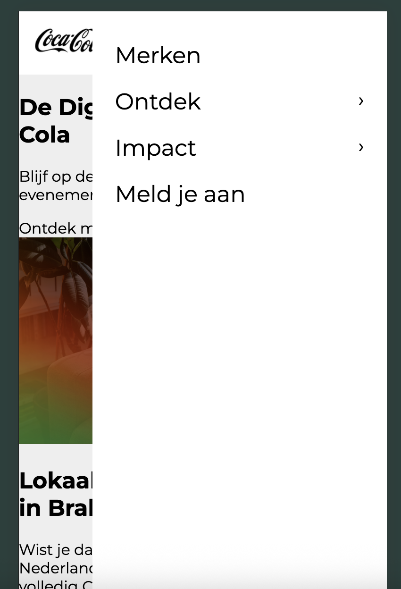
  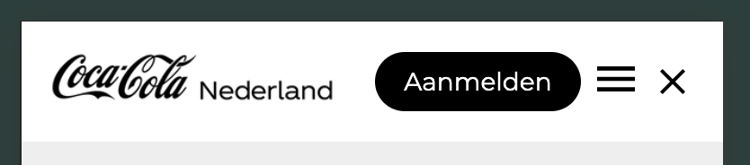
  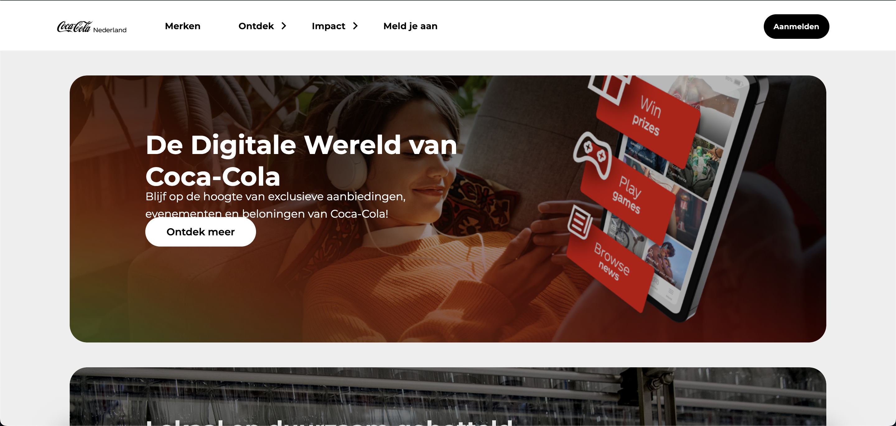

  

  ### Agenda voor meeting
  samen met je groepje opstellen

  | student 1      | student 2          | student 3    | student 4        |
  | ---            | ---                | ---          | ---              |
  |                | en dit             | en ik dit    | en dan ik dat    |
  |                | dit als er tijd is | nog een punt | dit wil ik zeker |
  |                | ...                | ...          | ...              |

  ### Verslag van meeting
  Ik kon helaas niet bij het 3e voortgangsgesprek zijn.

  Ik heb wel nog in week 8 Danny online gesproken op maandag en ben vrijdag naar een extra feedbackmoment geweest.
  Daar heb ik de volgende dingen nog opgestoken:

  - Custom properties toevoegen
  - 3e CSS bestand voor overlappende code toevoegen
  - Overlegd over carousel wat wel en wat niet hoeft
  - Zelfde voor kleine details footer.
  - Custom properties weer aangepast en verbeterd.

  Hier heb ik nog screenshots van na week 7, toen ik bezig was met het responsive maken:

  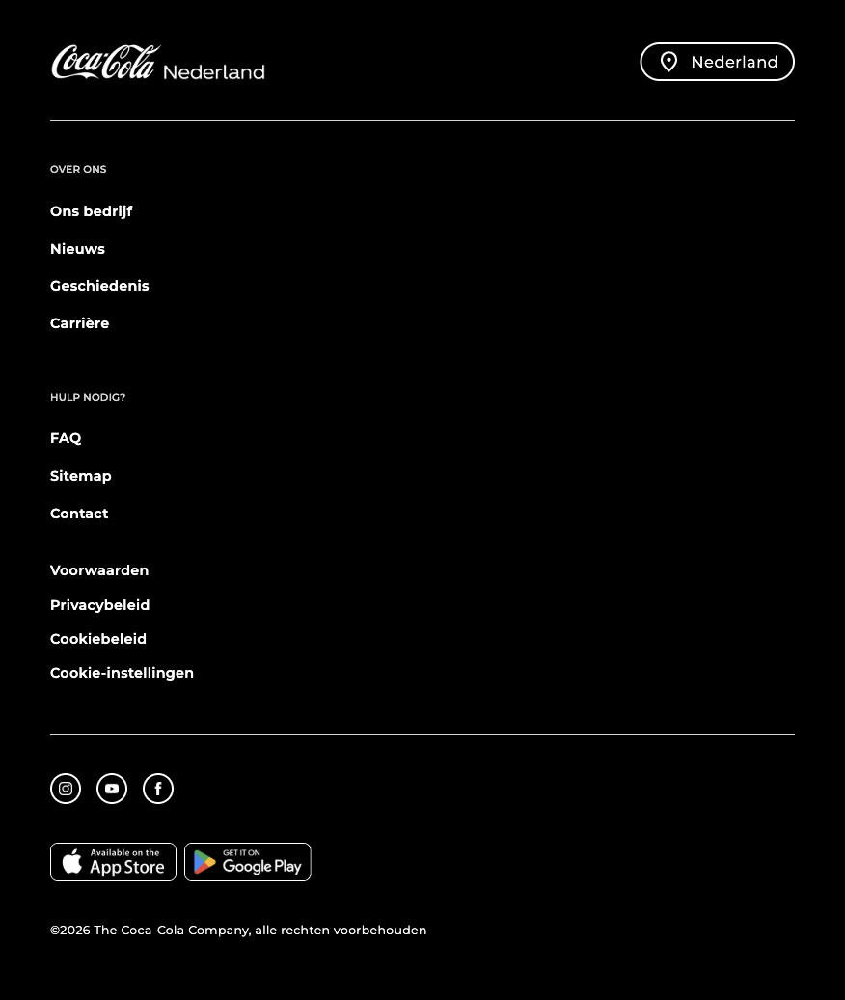
  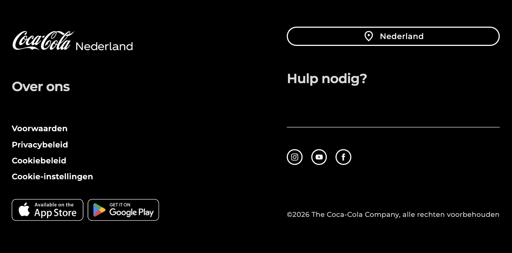
  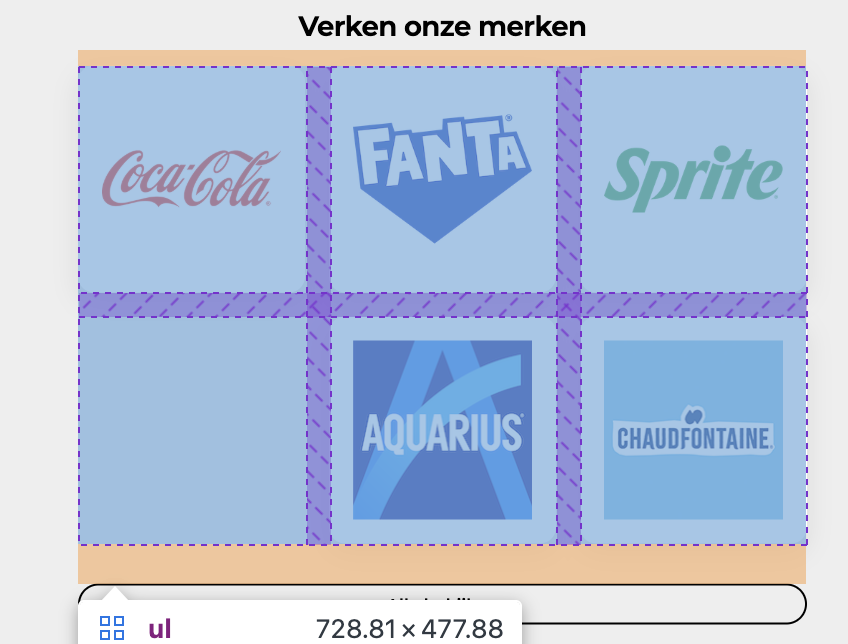
  

## Toegankelijkheidstest 2/2 (week 8)

  
uitwerken na test in 9e werkgroep

  ### Bevindingen
  - De les met de toegankelijkheidstest ging niet door dus ik had zelf verder geen middelen om beperkingen na te bootsen.
  - Wel kon ik natuurlijk met de voice-over door mijn site. Dit verliep wel goed. 
    Wanneer ik mijn site open begint de voice over gewoon direct. De coca-cola header wordt goed en duidelijk omschreven en aan het begin is er een 'Skip to content' knop/optie. Dat heb ik niet... 

    Wat bij mij wel beter gaat is dat de voice-over de hele carousel afgaat. Na de eerste kaart gaat hij automatisch naar de Athletes en hij gaat ze alle drie af voordat hij naar het volgende deel over de duurzaamheid gaat. Bij coca-cola gaat de voice-over na de eerste kaart door naar duurzaamheid en skipt eigenlijk de rest van de carousel.

    Ook heb ik aandacht besteed aan het herschrijven van de alt-teksten voor de kaarten in de carousel. Naar mijn mening zijn deze nu duidelijker. Coca-cola had niet eens echt een beschrijving voor de Athletes kaart in de carousel..
    Ook de rest van de afbeeldingen op de site heb ik bewust herbeschreven en ik heb bij knoppen/links een aria-label toegevoegd wat omschrijft waar de knop voor dient. Dit had coca-cola zelf ook niet

  - Ik ben de WCAG checklist opnieuw afgegaan en doordat ik de aria-labels heb toegevoegd aan de buttons en links heb ik dat verbeterd.
    Ik heb alleen dus geen skip link en de video heeft volgens mij dus wel ook autoplay wat beter van niet kan. 
    Wat ik later nog wel aangepast heb zijn de knoppen in het nav menu voor de mobile versie. Het leek mij dat er ruimte genoeg was om deze knoppen wat groter te maken zodat ze makkelijker klikbaar zijn.

    Ik zal de lijst meenemen naar het eindgesprek.
 

## Eindgesprek (week 9)

 
  
uitwerken voor eindgesprek

  ### Je uitkomst - karakteristiek screenshots:

  ### Home page mobile
  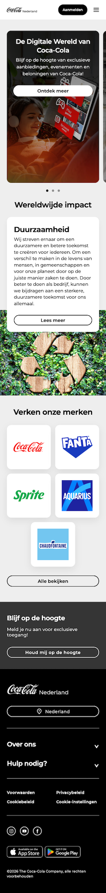

  ### Home page desktop
  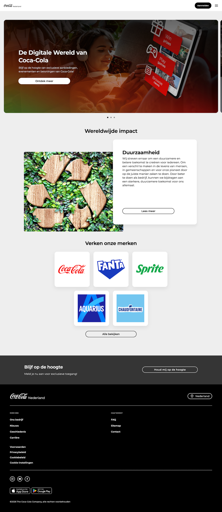
  
  ### Athletes page mobile
  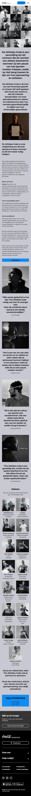

  ### Athletes page desktop
  

  ### Dit ging goed/Heb ik geleerd: 
  Als ik terug kijk op de afgelopen weken heb ik wel echt ontzettend veel geleerd.
  Het was jammer dat ik dit vak begon met zo'n slechte basis. Ik begreep eigenlijk echt bijna niks en dat is gelukkig nu wel heel anders.
  Mijn kennis voelt veel sterker en ik begrijp hoe dingen in elkaar zitten. Ik vind coderen wel gewoon nog steeds heel lastig, maar ik weet nu dat ik er echt wel kom en het allemaal vanzelf echt wel leer. Eigenlijk is tot nu toe alles gelukt om na te maken, op de carousel na, maar daar zou ik uiteindelijk vast ook achter kunnen komen met meer tijd. 

  Het responsive maken van de site ging gelukkig best goed. Ik had eerst geen idee hoe dat zou moeten en was bang dat ik het misschien niet zou kunnen. Toch koos ik voor die uitdaging omdat ik wel benieuwd was naar het leren ervan. Achteraf vond ik het best meevallen en ben ik blij dat ik nu gewoon weet hoe je dat aanpakt. 

  Ik heb echt m'n best gedaan en daar ben ik wel trots op. Ook ben ik best tevreden met het resultaat. Ik ben voornamelijk blij met het vertrouwen dat ik heb opgebouwd en ik vind het best cool om deze code kennis nu te hebben.

  ### Dit was lastig/Is niet gelukt:

  ! Ik ben de middag en avond na de deadline doorgegaan met coderen om de header en footer ook responsive te maken.
  Dit is gelukt :) Alleen bij de header mist de hover state nog op de navigatie. Normaalgesproken klapt het menu uit en komt er een zwarte lijn onder het menu item waar je muis op ligt, maar dit mist nu bij mijn site. De footer is verder ook helemaal responsive.

  Voor de landscape vorm kom ik er nu niet helemaal uit, deze lijkt hetzelfde als op de coca-cola site wanneer ik mijn mobiel kantel?

  ### Responsive header desktop af
  

  ### Responsive header desktop af
  

  ---------------------------------------------------------------------------------------------------------------------------------
  
  (Wanneer ik het maandag 19 januari om 14:00 inlever is het volgende helaas nog niet gelukt:

  - Het juist en responsive maken van de header en footer voor de desktop versie (vanaf 1200px).
    Dit heb ik gewoon niet meer gered qua tijd. Wel heb ik de header voor de desktop aan het begin van het blok gemaakt, dus deze code heb ik wel, van de footer nog niet.
  - Landscape/liggend voor responsive.
    Hier ben ik op het laatste moment pas achter gekomen dat dat ook nog moest en heb ik dus helaas niet meer gered.)

  Iets minder belangrijk, maar wat ik wel nog had gedaan met meer tijd:

  - De laatste section toevoegen aan de footer
  - Ik gebruik nu uiteindelijk twee div's. Eentje voor die laatste gedeelde section en eentje voor de kaart in de section over duurzaamheid op de index.html. Ik had hier nog naar willen kijken of dit ook zonder div kon.
  - Op het laatste moment heb ik gezien dat ik het kleine blauwe geluidsicoon dat over de video op theathletescode.html zit niet heb. 

  Wat ik lastig vond:
  - Vooral position: absolute/relative/etc. vind ik nog erg lastig te begrijpen. 
  - Grid en Flexbox heb ik ook nog wel echt hulp voor nodig, maar snap ik langzaamaan steeds meer.
  - Ik ben veel tijd kwijt geweest aan de carousel. Dat vond ik denk ik het lastigste onderdeel van de twee pagina's.

  ### Mijn header vanaf 1200px, klopt niet. Nav moet tevoorschijn komen
  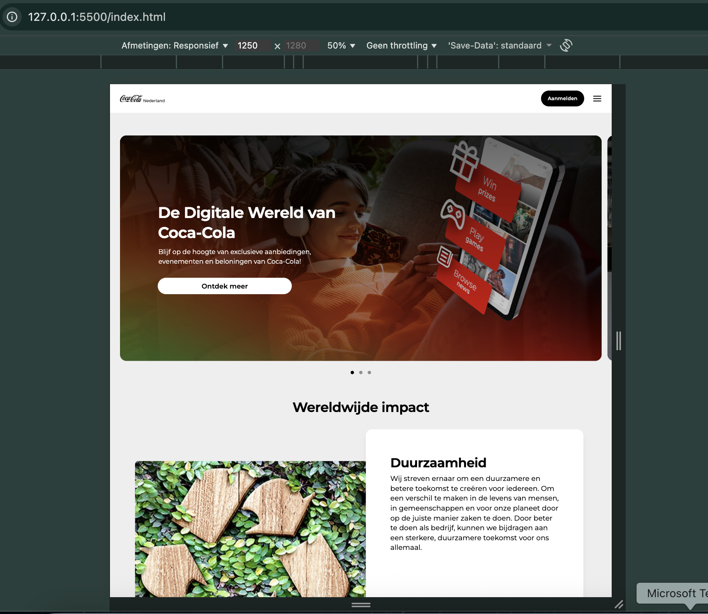

  ### De header die ik eerder had gemaakt. Klopt wel bijna
  

  ### De juiste header vanaf 1200px, van de coca-cola site
  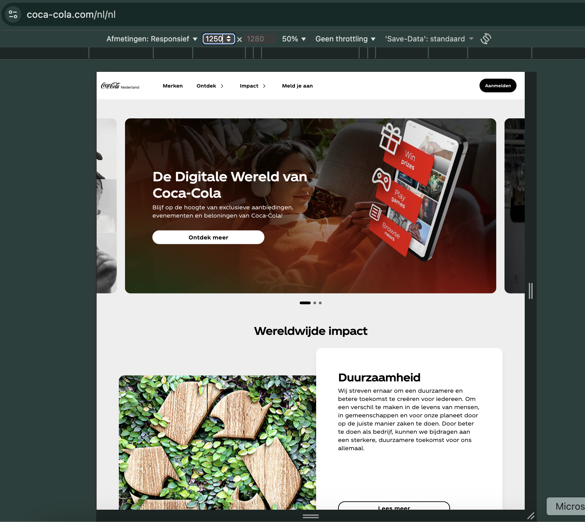

  ### Mijn footer van 375-600px, kloppend
  

  ### Mijn footer van 600-1200px, kloppend
  

  ### Mijn footer vanaf 1200px, groeit niet mee zoals het hoort
  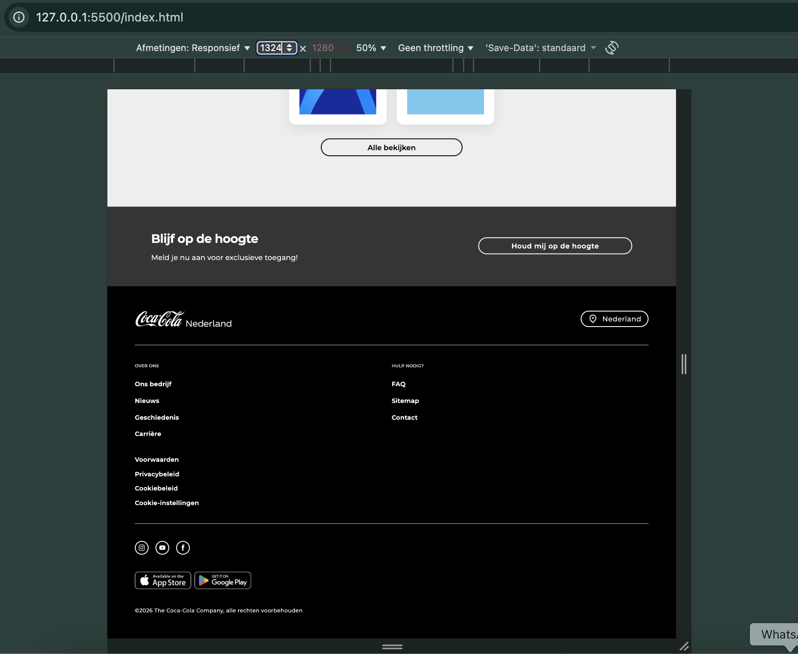

  ### De juiste footer vanaf 1200px, van de coca-cola site
  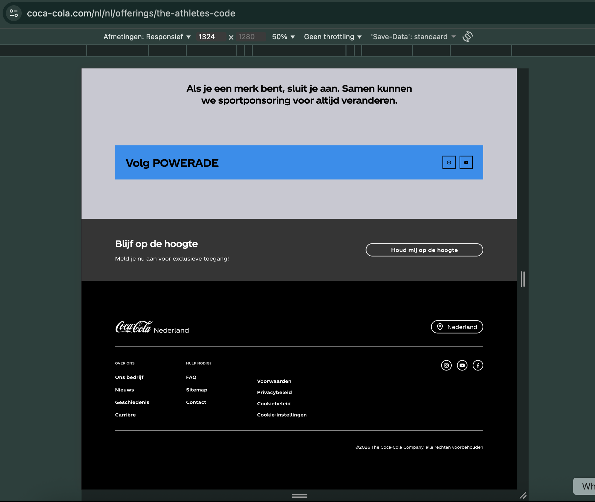

## Bronnenlijst

  
continu bijhouden terwijl je werkt

  Nb. Wees specifiek ('css-tricks' als bron is bijv. niet specifiek genoeg). 
  Nb. ChatGpT en andere AI horen er ook bij.
  Nb. Vermeld de bronnen ook in je code.

  1. https://css-tricks.com/snippets/css/a-guide-to-flexbox/ Voor het beter begrijpen en leren van flexbox
  2. https://medium.com/swlh/better-ways-to-organise-css-properties-9a066e7ded62 Voor de juiste volgorde van properties binnen de selector
  3. https://youtu.be/U8smiWQ8Seg?si=7CXJ_CeEp_YXCf-5 Voor tutorial hamburgermenu

  Ik heb veel gebruik gemaakt van ChatGpT. Niet alleen voor één ding specifiek, dus ik weet niet zo goed hoe ik dat bij de bronnen moet zetten. In mijn CSS bestanden heb ik aantekeningen gemaakt bij de delen waar ik echt hulp nodig had en nu ook nog lastig vind om zelf 100% te begrijpen/na te doen. Ik heb wel bij alle code die ik heb gekregen zelf aanpassingen gemaakt en de tijd genomen om te begrijpen wat wat doet en te leren hoe het werkt.
 
  Ik begrijp dat dit met de linkjes zo misschien niet helemaal ideaal is. Als de chat te lang werd liep het vast en moest ik een nieuwe beginnen, vandaar dat het er zo veel zijn. Ik heb geprobeerd ze allemaal te bewaren. Ik ga ervan uit dat dit echt niet allemaal volledig doorgelezen gaat worden, maar het leek me de meest eerlijke manier om te laten zien hoe ik het gebruikt heb? 

  4. https://chatgpt.com/share/696e284a-4c84-8002-8df7-85cc03c2957b 
  5. https://chatgpt.com/share/696e29df-aa70-8002-8822-af38a49d7787 
  6. https://chatgpt.com/share/696e2a17-4ab0-8002-a991-a5899a3595b4
  7. https://chatgpt.com/share/696e2a29-492c-8002-be61-9547b2d65af0
  8. https://chatgpt.com/share/696e2a38-0b9c-8002-b6d8-a9cab39c9373
  9. https://chatgpt.com/share/696e2a4a-8ad8-8002-8b10-7d735037d467
  10. https://chatgpt.com/share/696e2a58-5ec0-8002-b4d2-61e52bf792e7
  11. https://chatgpt.com/share/696e2a70-cd10-8002-b328-269ae131b930
  12. https://chatgpt.com/share/696e2b42-5cd0-8002-b869-c71598760997 
  13. https://chatgpt.com/share/696e2b7f-eb9c-8002-8b4a-fabdaad505ac
  14. https://chatgpt.com/share/696e2be7-b9e4-8002-8add-66562bee0903
  15. https://chatgpt.com/share/696e2dfc-8bec-8002-9c09-b63ae75242c4

